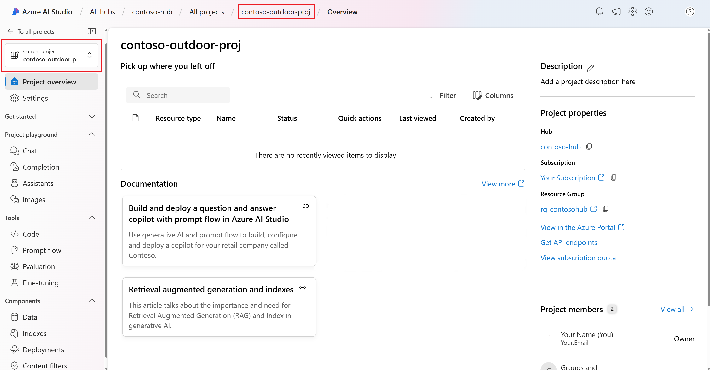

# Challenge 1: Setting Up a Project in Azure AI Studio

## Introduction
Sofia is embarking on a new project to develop a sophisticated Q&A Bot to help navigate the EU AI Act. After evaluating various platforms, Sofia chose Azure AI Studio for its robust capabilities, enterprise-grade security, and collaborative environment. Azure AI Studio will allow Sofia and her team to efficiently organize their work and build customized AI applications.

## Success Criteria
- **Project Creation**: Sofia verified that the project had been successfully created and appeared in the "Projects" section of Azure AI Studio.
- **Resource Configuration**: She ensured that all necessary resources had been configured and were accessible within the project.

By following these steps, Sofia successfully created and set up a project in Azure AI Studio, enabling her to organize her work efficiently and collaborate effectively while building customized AI applications.

## Resources

[Create a project in Azure AI Studio](https://learn.microsoft.com/en-us/azure/ai-studio/how-to/create-projects?tabs=ai-studio)
[Azure AI Studio Architecture](https://learn.microsoft.com/en-us/azure/ai-studio/concepts/architecture)