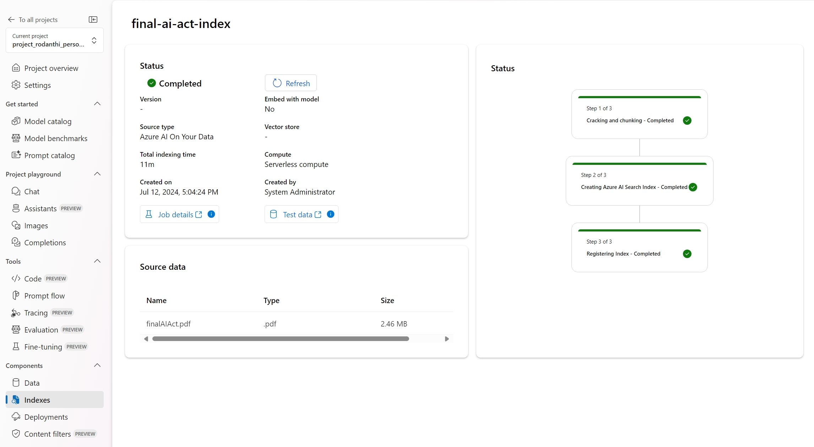

### Challenge 1 - Get your Data and make them Searchable

## Description
As Sofia, the lead AI engineer, you have determined that leveraging Azure AI Search is the optimal solution for indexing and searching through the EU AI Act documentation. This will allow your team to quickly access specific regulations and guidelines.

To proceed, you need to upload the EU AI Act documentation to Azure and create a search index. This process involves configuring the Azure AI Search service, preparing your data, and ensuring that it is indexed correctly for efficient search functionality.

You can create this process via the Azure Portal, via SDKs or via Azure AI Studio. Since Azure AI Studio gives you more flexibility in having all your main components in one UI you decide to go with this approach. 

## Success Criteria
- **Data Uploaded and Indexed**: Show that the EU AI Act documentation has been uploaded to Azure Storage and you have the correct permissions (Storage Blob Data Contributor).
- **Decide on the Search Approach**: Explain to your coach the difference between using or not vector search.
- **Index Creation**: Show to your coach your newly created index.
- **Search Functionality**: Validate that the search functionality works as expected by running queries and confirming accurate results (in Azure AI Search in Azure Portal)
- **Index Schema and Indexer Configuration**: Explain the index schema and indexer configuration, highlighting how they are set up to handle the EU AI Act documentation.

By following these steps, you will successfully configure Azure AI Search to make your data searchable, providing your team with the tools they need to efficiently navigate the EU AI Act.

## Tips
Ensure you have the right permissions to access your Azure Storage, specifically the role "Storage Blob Data Contributor" that you can set up in the Azure Storage service in Azure Portal.

## Learning Resources

[EU AI ACT Pdf](https://eur-lex.europa.eu/legal-content/EN/TXT/?uri=OJ:L_202401689)

Example Queries for EU AI Act index:
- **