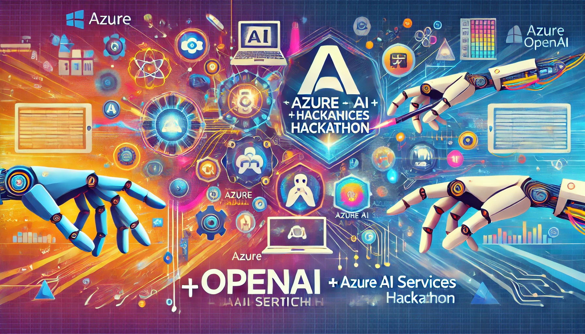

# Azure OpenAI + AI Services Hackathon

## Overview
The labs in this hackathon aim to equip participants with the knowledge and skills needed to develop advanced AI solutions using Azure OpenAI models and other Azure services. Each lab focuses on specific real-world use cases, guiding participants through the end-to-end development process.

## Labs

### 1. [EU AI Act Bot](./EU_AI_Act_Bot)
#### Level 100-200
Develop a Q&A Bot to help your team navigate and comply with the EU AI Act. This lab utilizes Azure OpenAI models and Azure AI Search to provide quick and accurate information about the legislation.

### 2. [Multimodal AI Bot](./Multimodal_Bot) (under construction)
#### Level 200-300 
Explore the development of a multimodal AI bot that can handle and process both text and image inputs, delivering rich and informative responses using Azure OpenAI and other Azure services.
Focus on PS, FSI, Gaming use casess

## Learning Objectives

- **Azure OpenAI Integration**: Learn how to integrate Azure OpenAI models to create a powerful Q&A bot.
- **Azure AI Search Utilization**: Discover how to use Azure AI Search to fetch and retrieve relevant information efficiently.
- **Bot Deployment**: Learn to deploy the bot on different platforms such as web, mobile, and messaging applications to maximize accessibility and user reach.
- **Multimodal Input Handling**: Understand the principles of multimodal AI, capable of processing both text and image inputs.
- **Advanced Azure OpenAI Capabilities**: Explore the advanced features of Azure OpenAI models in handling diverse data types.
- **Image and Text Processing**: Learn techniques to process and integrate image data alongside textual information to deliver comprehensive responses.

# Prerequisites

1. Azure Subscription with OpenAI access

## Labs List and Links

- **[EU AI Act Bot](./EU_AI_Act_Bot)**
- **[Multimodal AI Bot](./Multimodal_Bot)**

## Contribution and Feedback

We welcome contributions and feedback to improve these labs. If you have any suggestions or encounter any issues, please create an issue in this repository or submit a pull request.

Happy hacking!

